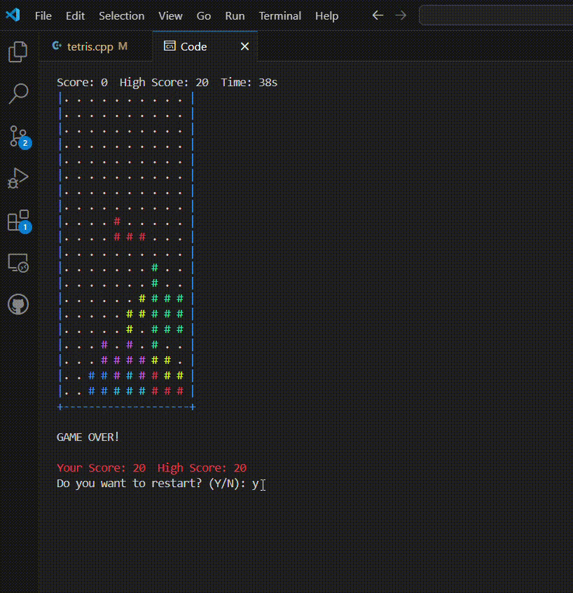

# Tetris Game in C++

████████╗███████╗████████╗██████╗░██╗░██████╗
╚══██╔══╝██╔════╝╚══██╔══╝██╔══██╗██║██╔════╝
░░░██║░░░█████╗░░░░░██║░░░██████╔╝██║╚█████╗░
░░░██║░░░██╔══╝░░░░░██║░░░██╔══██╗██║░╚═══██╗
░░░██║░░░███████╗░░░██║░░░██║░░██║██║██████╔╝
░░░╚═╝░░░╚══════╝░░░╚═╝░░░╚═╝░░╚═╝╚═╝╚═════╝░
## Project Breif

This is a console-based *Tetris Game* built using *C++* as part of our Object-Oriented Programming (OOP) project. The game includes:

- 7 classic tetromino shapes.
- Colorful graphics with random spawning.
- Real-time key controls for movement and rotation.
- Score tracking and high score system.

## How the Game Works

- The goal is to arrange falling tetrominoes to form complete horizontal lines.
- Completed lines disappear, and you earn points.
- The game ends when the tetrominoes stack up to the top.

## Game Features

- **Controls:**
  - Left Arrow → Move left
  - Right Arrow → Move right
  - Up Arrow → Rotate tetromino
  - Down Arrow → Move down faster
  - X → Exit the game
- **Scoring System:**
  - 10 points per cleared line.
- **High Score System:**
  - Tracks the highest score for the session.
- **Game Timer:**
  - Shows elapsed playtime.

## ⚙ How to Run

1. **Requirements:**
   - Windows OS
   - C++ compiler (e.g., MinGW, Visual Studio, or similar)

2. **Compile the code:**

   ```bash
   g++ tetris.cpp -o tetris
 

